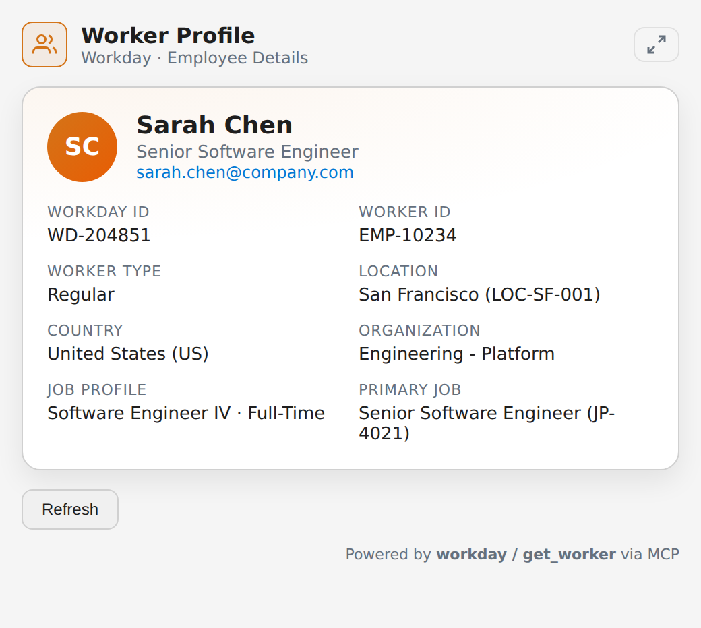
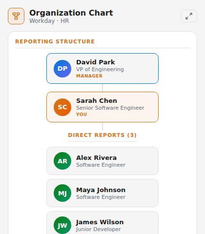
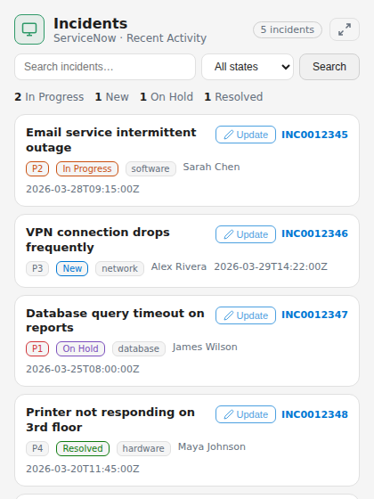
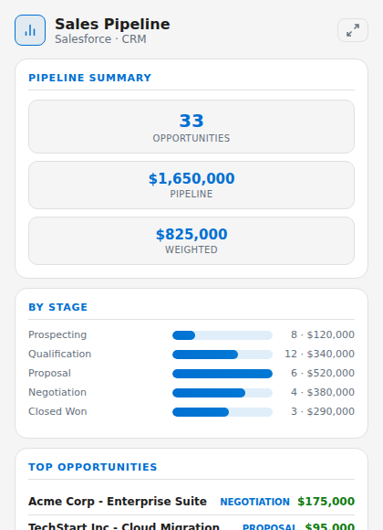
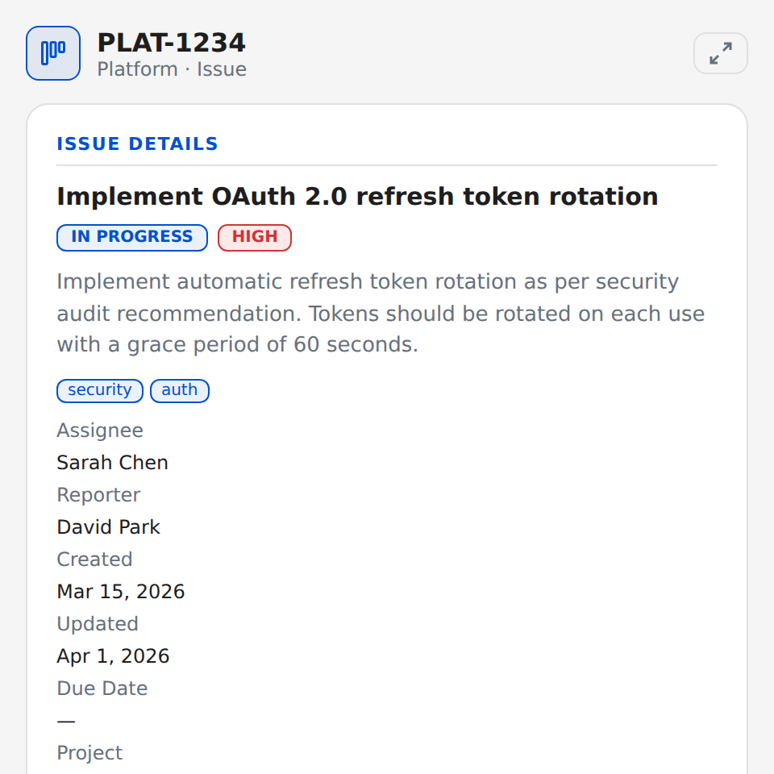
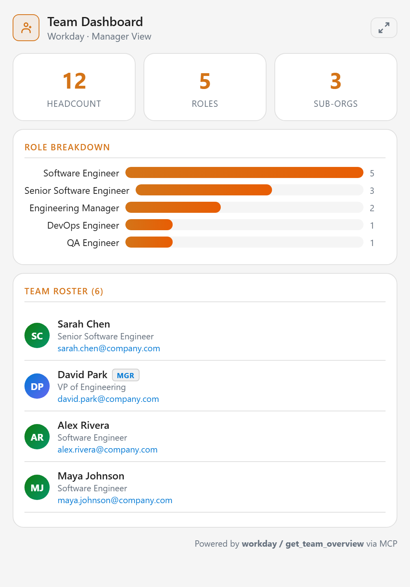
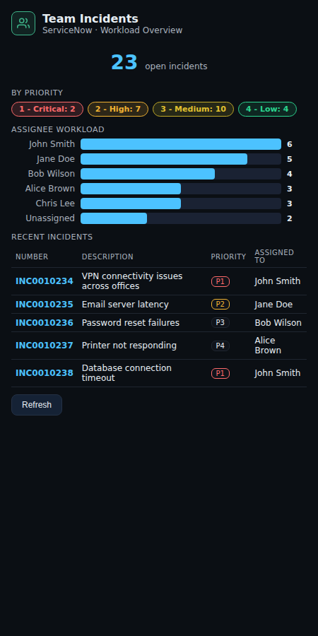
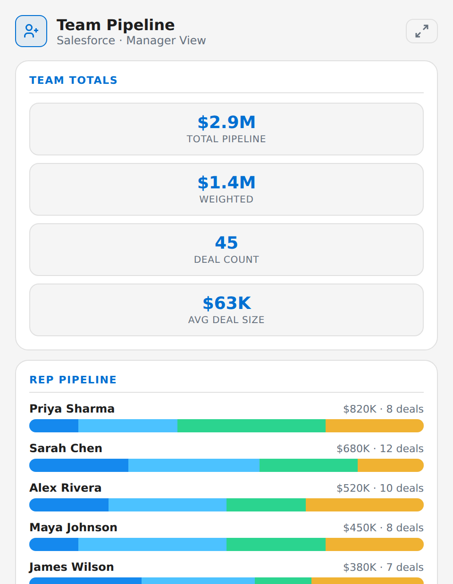
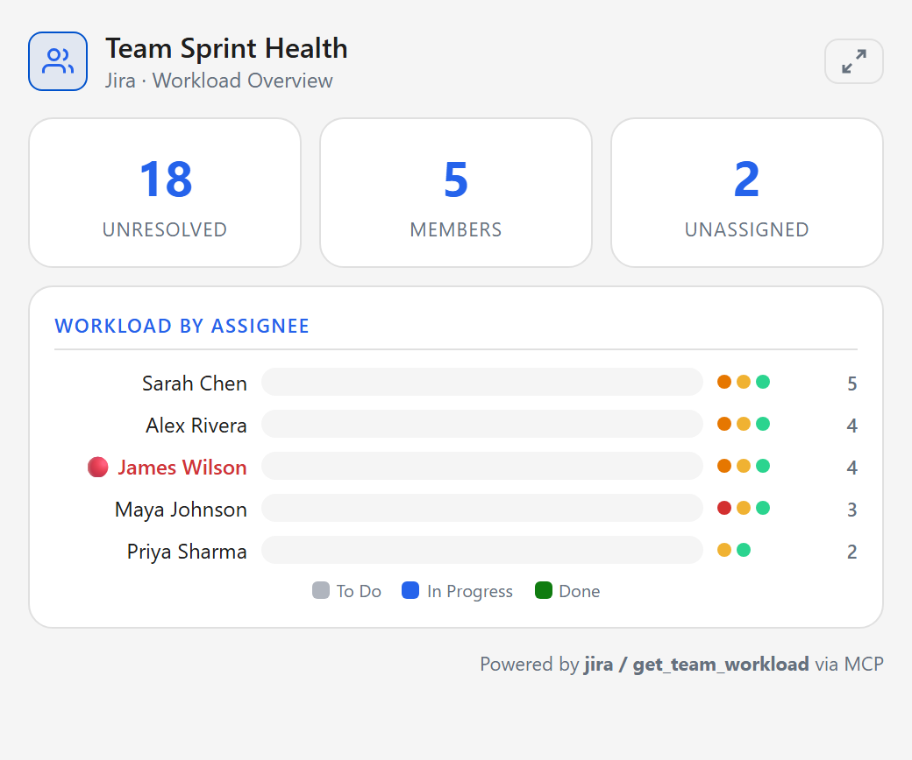

<p align="center">
  <h1 align="center">🏢 ESS-MCP</h1>
  <p align="center">
    <strong>Enterprise Self-Service MCP Servers</strong><br/>
    Modular <a href="https://modelcontextprotocol.io/">Model Context Protocol</a> servers for Workday, ServiceNow, Salesforce, and Jira
  </p>
  <p align="center">
    <a href="#-quick-start"></a>
    <a href="#%EF%B8%8F-azure-deployment"></a>
    <a href="#-mcp-servers"></a>
  </p>
</p>

---

## 📖 Overview

**ESS-MCP** is a suite of [Model Context Protocol (MCP)](https://modelcontextprotocol.io/) servers that connect AI assistants to enterprise systems. Each server exposes **actionable tools** and interactive UI widgets that let an AI agent **read, create, update, and act** on behalf of employees and managers:

| Server | Platform | Tools | Widgets | Key Actions |
|--------|----------|-------|---------|-------------|
| **Workday** | HR / HCM | 21 | 6 | Book leave, change title, view compensation, org charts, **team dashboard** |
| **ServiceNow** | ITSM | 36 | 5 | Create/update incidents, approve/reject requests, order catalog items, manage change requests, **team incidents** |
| **Salesforce** | CRM | 39 | 9 | Create opportunities/leads/quotes, approve/reject, convert leads, run reports, **team pipeline** |
| **Jira** | Project Management | 21 | 5 | Create/update issues, transition workflows, log work, manage sprints, **team workload** |

> **117 tools total** — 37 are write/action tools (create, update, approve, transition), 11 render interactive form widgets, and the rest provide rich read access. Designed for AI agents that **can act**, not just answer questions.

Servers can be deployed **individually**, in **any combination**, or **all together** — both locally and on Azure Container Apps with a single command.

---

## 🖼️ Widget Screenshots

ESS-MCP includes 25 interactive HTML+Skybridge widgets that render directly in AI assistant UIs, including 4 manager-specific team dashboards.

### Self-Service Widgets

<table>
  <tr>
    <td align="center"><strong>Workday – Worker Profile</strong></td>
    <td align="center"><strong>Workday – Org Chart</strong></td>
  </tr>
  <tr>
    <td></td>
    <td></td>
  </tr>
  <tr>
    <td align="center"><strong>ServiceNow – Incident List</strong></td>
    <td align="center"><strong>Salesforce – Sales Pipeline</strong></td>
  </tr>
  <tr>
    <td></td>
    <td></td>
  </tr>
  <tr>
    <td align="center" colspan="2"><strong>Jira – Issue Detail</strong></td>
  </tr>
  <tr>
    <td colspan="2" align="center"></td>
  </tr>
</table>

### Manager Widgets

<table>
  <tr>
    <td align="center"><strong>Workday – Team Dashboard</strong></td>
    <td align="center"><strong>ServiceNow – Team Incidents</strong></td>
  </tr>
  <tr>
    <td></td>
    <td></td>
  </tr>
  <tr>
    <td align="center"><strong>Salesforce – Team Pipeline</strong></td>
    <td align="center"><strong>Jira – Team Sprint Health</strong></td>
  </tr>
  <tr>
    <td></td>
    <td></td>
  </tr>
</table>

---

## 🏗️ Architecture

```
┌─────────────────────────────────────────────────────────────┐
│                      AI Assistant / Client                  │
│               (ChatGPT, Copilot, Claude, etc.)              │
└──────────────┬──────────────────────────────────┬───────────┘
               │  MCP (SSE / Streamable HTTP)     │
               ▼                                  ▼
┌──────────────────────────────────────────────────────────────┐
│                    ESS-MCP Gateway (:8080)                   │
│                                                              │
│  /workday/mcp   /servicenow/mcp  /salesforce/mcp  /jira/mcp │
│  /workday/sse   /servicenow/sse  /salesforce/sse  /jira/sse │
│  /healthz                                                    │
│                                                              │
│  ┌───────────┐ ┌──────────────┐ ┌────────────┐ ┌──────────┐ │
│  │  Workday  │ │  ServiceNow  │ │ Salesforce  │ │   Jira   │ │
│  │  Server   │ │   Server     │ │   Server    │ │  Server  │ │
│  └─────┬─────┘ └──────┬───────┘ └──────┬─────┘ └────┬─────┘ │
│        │               │                │            │        │
│        │         Bearer Token Passthrough             │        │
└────────┼───────────────┼────────────────┼────────────┼───────┘
         ▼               ▼                ▼            ▼
   Workday API    ServiceNow API   Salesforce API  Jira Cloud API
```

Each MCP server:
- **Extracts** bearer tokens from incoming requests (OAuth 2.0 passthrough)
- **Exposes** tools for CRUD operations against the target platform
- **Serves** interactive HTML+Skybridge widgets for rich UI rendering
- **Runs** independently or composed behind a shared ASGI gateway

---

## 🚀 Quick Start

### Prerequisites

- **Python 3.11+**
- **Docker** (for containerised deployment)
- **Azure CLI** (for Azure deployment)

### Local Development

```bash
# Clone the repository
git clone https://github.com/scadam/ess-mcp.git
cd ess-mcp/mcp_servers

# Install in development mode
pip install -e ".[dev]"

# Copy and configure environment files
cp env/workday.example.env env/workday.env
cp env/servicenow.example.env env/servicenow.env
cp env/salesforce.example.env env/salesforce.env
cp env/jira.example.env env/jira.env
# Edit each .env file with your service URLs

# Run a single server (stdio – for direct MCP client connection)
python -m mcp_servers.cli workday --transport stdio

# Run a single server (HTTP)
python -m mcp_servers.cli jira --transport http --port 8080

# Run all servers (HTTP + SSE)
python -m mcp_servers.cli all --transport both --port 8080
```

### Docker

```bash
cd mcp_servers

# Build the image
docker build -t ess-mcp .

# Run all servers
docker run -p 8080:8080 ess-mcp

# Run specific servers with env vars
docker run -p 8080:8080 \
  -e JIRA_BASE_URL=https://yourorg.atlassian.net \
  ess-mcp python -m mcp_servers.cli jira --transport both --host 0.0.0.0 --port 8080
```

### Verify

```bash
# Health check
curl http://localhost:8080/healthz
# → {"status": "ok"}

# MCP endpoint (Streamable HTTP)
curl -X POST http://localhost:8080/workday/mcp \
  -H "Content-Type: application/json" \
  -d '{"jsonrpc":"2.0","method":"tools/list","id":1}'
```

---

## ☁️ Azure Deployment

Deploy to **Azure Container Apps** with a single command. The script provisions all required infrastructure from scratch — you only need an Azure subscription.

### What Gets Created

| Resource | Purpose |
|----------|---------|
| **Resource Group** | Logical container for all resources |
| **Azure Container Registry** | Hosts the Docker image |
| **Log Analytics Workspace** | Centralised logging and monitoring |
| **Container App Environment** | Managed Kubernetes-based hosting |
| **Container App(s)** | One per selected MCP server |

### Single-Click Deploy

```bash
# Deploy ALL servers (default)
./deploy/deploy.sh

# Deploy a single server
./deploy/deploy.sh --servers workday

# Deploy specific servers
./deploy/deploy.sh --servers workday,jira

# Deploy with custom settings
./deploy/deploy.sh \
  --servers workday,servicenow \
  --location westeurope \
  --name myessmcp \
  --env-file deploy/.env
```

### Deployment Options

| Option | Default | Description |
|--------|---------|-------------|
| `-s, --servers` | `all` | Comma-separated: `workday`, `servicenow`, `salesforce`, `jira`, or `all` |
| `-l, --location` | `eastus` | Azure region |
| `-n, --name` | `essmcp` | Base name for resources (3–16 chars) |
| `-t, --tag` | `latest` | Docker image tag |
| `--cpu` | `0.5` | CPU cores per container |
| `--memory` | `1Gi` | Memory per container |
| `--min-replicas` | `0` | Minimum replica count (0 = scale to zero) |
| `--max-replicas` | `3` | Maximum replica count |
| `-e, --env-file` | — | Path to `.env` file with service configuration |
| `--resource-group` | `{name}-rg` | Use an existing resource group |
| `--subscription` | — | Azure subscription ID or name |
| `--dry-run` | — | Preview what would be deployed |

### Configure Environment

```bash
# Copy the example environment file
cp deploy/.env.example deploy/.env

# Edit with your service URLs
# Only fill in variables for the servers you're deploying
nano deploy/.env

# Deploy with configuration
./deploy/deploy.sh --servers workday,jira --env-file deploy/.env
```

### Post-Deployment

After deployment, the script prints each server's endpoints:

```
━━━ Deployment Summary ━━━

  workday:
    MCP:    https://essmcp-workday.azurecontainerapps.io/workday/mcp
    SSE:    https://essmcp-workday.azurecontainerapps.io/workday/sse
    Health: https://essmcp-workday.azurecontainerapps.io/healthz

  jira:
    MCP:    https://essmcp-jira.azurecontainerapps.io/jira/mcp
    SSE:    https://essmcp-jira.azurecontainerapps.io/jira/sse
    Health: https://essmcp-jira.azurecontainerapps.io/healthz
```

```bash
# View logs
az containerapp logs show --name essmcp-workday --resource-group essmcp-rg

# Clean up all resources
az group delete --name essmcp-rg --yes --no-wait
```

---

## 🔧 MCP Servers

### Workday – HR / Employee Self-Service

> *Employee profiles, leave management, compensation, org hierarchy, learning, and team calendar.*

**Tools (21):**

| Tool | Type | Description |
|------|------|-------------|
| `get_worker` | 📖 Read | Fetch current worker profile |
| `get_leave_balances` | 📖 Read | View PTO / leave balances |
| `get_direct_reports` | 📖 Read | List direct reports |
| `get_inbox_tasks` | 📖 Read | Fetch pending approval tasks |
| `get_learning_assignments` | 📖 Read | View learning initiatives |
| `get_pay_slips` | 📖 Read | Access payroll information |
| `get_time_off_entries` | 📖 Read | Historical time-off records |
| `prepare_request_leave` | 🖼️ Widget | Show interactive leave booking form |
| `book_leave` | ✏️ **Create** | **Submit leave request** |
| `prepare_change_business_title` | 🖼️ Widget | Show business title change form |
| `change_business_title` | ✏️ **Update** | **Submit business title change** |
| `search_learning_content` | 📖 Read | Search the learning library |
| `get_compensation` | 📖 Read | Salary and bonus information |
| `get_benefits` | 📖 Read | Benefits enrollment and coverage |
| `get_job_history` | 📖 Read | Career progression history |
| `get_org_chart` | 📖 Read | Organization hierarchy |
| `get_worker_documents` | 📖 Read | HR documents |
| `get_team_calendar` | 📖 Read | Team availability calendar |
| `get_team_overview` | 📖 Read | 👔 **Manager:** Team headcount dashboard with role/org breakdown |
| `get_team_compensation_summary` | 📖 Read | 👔 **Manager:** Aggregate team salary statistics |
| `get_team_performance_summary` | 📖 Read | 👔 **Manager:** Pending reviews, team absences, action items |

**Widgets:** `worker-profile`, `leave-booking`, `compensation-summary`, `org-chart`, `team-calendar`, `team-dashboard`

**Configuration** (`env/workday.env`):
```env
WORKDAY_WORKERS_API_URL=https://your-workday.com/api/v1/workers
```

---

### ServiceNow – IT Service Management

> *Incidents, change requests, problems, service catalog, knowledge base, approvals, and CMDB.*

**Tools (36):**

| Tool | Type | Description |
|------|------|-------------|
| `list_incidents` / `get_incident` | 📖 Read | View and search incidents |
| `create_incident` | ✏️ **Create** | **Create new IT service ticket** |
| `update_incident` | ✏️ **Update** | **Update incident fields/state** |
| `show_create_incident_form` | 🖼️ Widget | Interactive incident creation form |
| `show_update_incident_form` | 🖼️ Widget | Interactive incident update form |
| `list_tasks` | 📖 Read | List active tasks |
| `list_approvals` / `get_approval` | 📖 Read | View pending approvals |
| `approve_reject` | ⚡ **Action** | **Approve or reject approval request** |
| `list_catalog_items` / `list_catalog_categories` | 📖 Read | Browse service catalog |
| `get_catalog_item` | 📖 Read | Get catalog item details with form |
| `order_catalog_item` | ✏️ **Create** | **Order catalog item directly** |
| `add_to_cart` | ✏️ **Create** | **Add item to shopping cart** |
| `get_cart` | 📖 Read | View shopping cart contents |
| `checkout_cart` | ⚡ **Action** | **Submit cart as order** |
| `delete_cart` / `remove_cart_item` | 🗑️ **Delete** | **Empty cart or remove items** |
| `list_my_requests` | 📖 Read | List user's service requests |
| `list_change_requests` / `get_change_request` | 📖 Read | View change requests |
| `create_change_request` | ✏️ **Create** | **Create change request** |
| `update_change_request` | ✏️ **Update** | **Update change request** |
| `show_create_change_request_form` | 🖼️ Widget | Interactive change request form |
| `search_knowledge` / `get_knowledge_article` | 📖 Read | Search knowledge base |
| `list_problems` | 📖 Read | List problem records |
| `create_problem` | ✏️ **Create** | **Create problem record** |
| `update_problem` | ✏️ **Update** | **Update problem record** |
| `show_create_problem_form` | 🖼️ Widget | Interactive problem creation form |
| `search_reference_values` | 📖 Read | Search table values for form dropdowns |
| `get_cmdb_ci` / `list_cmdb_cis` | 📖 Read | CMDB configuration items |
| `get_team_incidents` | 📖 Read | 👔 **Manager:** Team incident workload dashboard |
| `get_team_approvals` | 📖 Read | 👔 **Manager:** Bulk team approvals view |

**Widgets:** `incident-list`, `create-incident`, `team-incidents`, `create-change-request`, `create-problem`

**Configuration** (`env/servicenow.env`):
```env
SERVICENOW_INSTANCE_URL=https://yourinstance.service-now.com
```

---

### Salesforce – CRM

> *Accounts, contacts, opportunities, leads, campaigns, pipeline dashboards, and compliance cases.*

**Tools (39):**

| Tool | Type | Description |
|------|------|-------------|
| `list_accounts` / `get_account_360` | 📖 Read | Account lookup and 360° view (contacts, opps, cases, tasks) |
| `list_contacts` | 📖 Read | Contact directory (optionally scoped to account) |
| `list_opportunities` | 📖 Read | List opportunities/deals |
| `create_opportunity` | ✏️ **Create** | **Create new opportunity** |
| `create_opportunity_task` | ✏️ **Create** | **Create task linked to opportunity** |
| `update_opportunity` | ✏️ **Update** | **Update opportunity fields** |
| `show_create_opportunity_form` | 🖼️ Widget | Interactive opportunity creation form |
| `list_leads` / `get_lead` | 📖 Read | Lead management |
| `create_lead` | ✏️ **Create** | **Create new lead** |
| `update_lead` | ✏️ **Update** | **Update lead information** |
| `convert_lead` | ⚡ **Action** | **Convert lead to account/contact/opportunity** |
| `show_create_lead_form` | 🖼️ Widget | Interactive lead creation form |
| `list_campaigns` / `get_campaign` | 📖 Read | Campaign tracking |
| `get_pipeline_dashboard` | 📖 Read | Pipeline analytics |
| `list_cases` / `get_case` | 📖 Read | Compliance case lookup |
| `create_case` | ✏️ **Create** | **Create compliance case** |
| `update_case` | ✏️ **Update** | **Update case status/description** |
| `show_compliance_case_form` | 🖼️ Widget | Interactive compliance case form |
| `list_tasks` / `get_task` | 📖 Read | Task management |
| `update_task` | ✏️ **Update** | **Update task status/priority** |
| `list_approvals` | 📖 Read | View pending approval work items |
| `approve_reject` | ⚡ **Action** | **Approve or reject approval requests** |
| `create_event` | ✏️ **Create** | **Create event/meeting** |
| `update_event` | ✏️ **Update** | **Update event details** |
| `show_create_event_form` | 🖼️ Widget | Interactive event creation form |
| `create_quote` | ✏️ **Create** | **Create quote linked to opportunity** |
| `update_quote` | ✏️ **Update** | **Update existing quote** |
| `show_create_quote_form` | 🖼️ Widget | Interactive quote creation form |
| `list_products` | 📖 Read | Product catalog |
| `get_forecast` | 📖 Read | Sales forecast / pipeline summary |
| `list_reports` / `run_report` | 📖 Read | Run Salesforce reports |
| `get_team_pipeline_summary` | 📖 Read | 👔 **Manager:** Team pipeline by rep |
| `get_team_performance_metrics` | 📖 Read | 👔 **Manager:** Sales leaderboard and win rates |

**Widgets:** `crm-account-360`, `crm-pipeline`, `crm-opportunity`, `crm-event`, `compliance-case`, `crm-lead`, `crm-quote`, `lead-pipeline`, `team-pipeline`

**Configuration** (`env/salesforce.env`):
```env
SALESFORCE_DOMAIN=yourorg.my.salesforce.com
```

---

### Jira – Project Management

> *Issues, sprints, boards, epics, comments, and transitions.*

**Tools:**

| Tool | Description |
|------|-------------|
| `list_issues` / `get_issue` | Issue queries |
| `create_issue` / `update_issue` | Issue management |
| `transition_issue` | Workflow transitions |
| `add_comment` | Add comments |
| `create_project` | Project creation |
| `list_boards` / `get_board` | Board management |
| `list_sprints` / `get_sprint` | Sprint tracking |
| `get_backlog` | Backlog views |
| `get_team_workload` | 👔 **Manager:** Team workload distribution |
| `get_team_sprint_health` | 👔 **Manager:** Sprint health across boards |

**Widgets:** `jira-issue`, `create-issue`, `create-project`, `team-sprint-health`

**Configuration** (`env/jira.env`):
```env
JIRA_BASE_URL=https://yourorg.atlassian.net
JIRA_PROJECT_KEY=PROJ  # Optional
```

---

## 🔌 Transport Modes

| Mode | Command | Use Case |
|------|---------|----------|
| **stdio** | `--transport stdio` | Direct MCP client integration (single server only) |
| **SSE** | `--transport sse` | Server-Sent Events for streaming |
| **HTTP** | `--transport http` | Streamable HTTP for request/response |
| **Both** | `--transport both` | SSE + HTTP simultaneously (default for Docker) |

**Endpoints** (when running all servers with `--transport both`):

| Path | Transport |
|------|-----------|
| `/{server}/mcp` | Streamable HTTP |
| `/{server}/sse` | Server-Sent Events |
| `/healthz` | Health check |

---

## 🔐 Authentication

ESS-MCP uses **OAuth 2.0 bearer token passthrough** — the MCP server extracts the bearer token from each incoming request's `Authorization` header and forwards it to the target SaaS API. No tokens are stored or validated by the MCP layer.

```
Client → Authorization: Bearer <token> → MCP Server → Bearer <token> → SaaS API
```

The MCP client is responsible for obtaining a valid bearer token for the target SaaS API (e.g. via OAuth 2.0 authorization code flow, client credentials grant, or any other mechanism). The MCP server simply passes the token through — it does not perform any token exchange, refresh, or validation.

### OAuth Client Setup per SaaS Platform

Each SaaS platform requires an OAuth 2.0 client registration so that the AI assistant (e.g. Microsoft 365 Copilot) can obtain bearer tokens on behalf of users. Below are step-by-step guides for creating OAuth clients with the **Authorization Code flow** for each platform.

<details>
<summary><strong>Workday – OAuth 2.0 Client (Authorization Code Grant)</strong></summary>

Workday uses **API Clients for Integrations** registered through the Workday tenant.

1. **Sign in** to your Workday tenant as a Security Administrator.
2. Navigate to **Register API Client for Integrations** (search in the Workday search bar).
3. Fill in the registration form:
   - **Client Name:** `ESS-MCP Copilot` (or your preferred name)
   - **Grant Type:** Select **Authorization Code Grant**
   - **Access Token Type:** `Bearer`
   - **Redirect URI:** Add your callback URL, e.g.:
     - For Teams Developer Center: `https://teams.microsoft.com/api/platform/v1.0/oAuthRedirect`
     - For local testing: `http://localhost:8080/callback`
   - **Scope:** Select the functional areas your integration needs:
     - `Staffing` – worker profiles, org charts
     - `Time Off and Leave` – leave balances and booking
     - `Compensation` – salary and bonus data
     - `Learning` – training assignments
     - `Tenant Non-Configurable` – basic tenant access
4. Click **OK** to register. **Copy the Client ID and Client Secret** — the secret is only shown once.
5. Navigate to **View API Clients** to verify your registration.
6. **Create an Integration System User (ISU):**
   - Go to **Create Integration System User**.
   - Assign the user to a security group that has the required domain permissions.
7. **Configure Authentication Policy:**
   - Navigate to **Manage Authentication Policies**.
   - Add a rule to allow OAuth 2.0 authentication for your ISU.

**Token Endpoints:**
```
Authorization: https://your-tenant.workday.com/authorize
Token:         https://your-tenant.workday.com/token
```

</details>

<details>
<summary><strong>ServiceNow – OAuth 2.0 Application Registry</strong></summary>

ServiceNow uses the **Application Registry** to create OAuth clients.

1. **Sign in** to your ServiceNow instance as an admin.
2. Navigate to **System OAuth → Application Registry** (or search for "Application Registry").
3. Click **New** and select **Create an OAuth API endpoint for external clients**.
4. Fill in the form:
   - **Name:** `ESS-MCP Copilot`
   - **Client ID:** Auto-generated (or set your own)
   - **Client Secret:** Click **Generate** — **copy and save this immediately**
   - **Redirect URL:** `https://teams.microsoft.com/api/platform/v1.0/oAuthRedirect`
   - **Token Lifespan:** `1800` seconds (30 minutes) — adjust as needed
   - **Refresh Token Lifespan:** `8640000` seconds (100 days)
   - **Active:** ✅ Checked
5. Click **Submit**.
6. **Enable OAuth scopes** (if using scoped access):
   - Navigate to **System OAuth → OAuth Scopes**.
   - Create scopes for `useraccount`, `incident_read`, `incident_write`, etc.
7. **Verify** by navigating back to **Application Registry** and confirming the entry.

**Token Endpoints:**
```
Authorization: https://yourinstance.service-now.com/oauth_auth.do
Token:         https://yourinstance.service-now.com/oauth_token.do
```

</details>

<details>
<summary><strong>Salesforce – Connected App (OAuth 2.0)</strong></summary>

Salesforce uses **Connected Apps** for OAuth 2.0 integration.

1. **Sign in** to Salesforce as a System Administrator.
2. Navigate to **Setup → Apps → App Manager** (or search "App Manager" in Quick Find).
3. Click **New Connected App** (top right).
4. Fill in the **Basic Information**:
   - **Connected App Name:** `ESS-MCP Copilot`
   - **API Name:** `ESS_MCP_Copilot`
   - **Contact Email:** your admin email
5. Under **API (Enable OAuth Settings)**:
   - ✅ **Enable OAuth Settings**
   - **Callback URL:** `https://teams.microsoft.com/api/platform/v1.0/oAuthRedirect`
   - **Selected OAuth Scopes** — add:
     - `Full access (full)`
     - `Perform requests at any time (refresh_token, offline_access)`
     - Or more granular: `Access and manage your data (api)`, `Access custom permissions (custom_permissions)`
   - ✅ **Require Secret for Web Server Flow**
   - ✅ **Require Secret for Refresh Token Flow**
   - ✅ **Enable Authorization Code and Credentials Flow**
6. Click **Save**. Wait 2–10 minutes for the Connected App to propagate.
7. Click **Manage Consumer Details** to view and copy the **Consumer Key** (Client ID) and **Consumer Secret** (Client Secret).
8. **Configure Policies** (optional but recommended):
   - Go to **Setup → Connected Apps → Manage Connected Apps**.
   - Click your app → **Edit Policies**.
   - Set **Permitted Users** to "Admin approved users are pre-authorized" if you want to restrict access.
   - Set **IP Relaxation** as appropriate.

**Token Endpoints:**
```
Authorization: https://login.salesforce.com/services/oauth2/authorize
Token:         https://login.salesforce.com/services/oauth2/token
```
For sandboxes, replace `login.salesforce.com` with `test.salesforce.com`.

</details>

<details>
<summary><strong>Jira Cloud – OAuth 2.0 App (3LO)</strong></summary>

Jira Cloud uses the **Atlassian Developer Console** for OAuth 2.0 (3-legged OAuth).

1. Go to [developer.atlassian.com/console/myapps](https://developer.atlassian.com/console/myapps/) and sign in.
2. Click **Create** → **OAuth 2.0 integration**.
3. Fill in:
   - **Name:** `ESS-MCP Copilot`
   - **Agree** to the developer terms.
4. Click **Create**.
5. In your app settings, go to **Authorization** → **Add** next to **OAuth 2.0 (3LO)**.
6. Set the **Callback URL:** `https://teams.microsoft.com/api/platform/v1.0/oAuthRedirect`
7. Go to **Permissions** and add the required Jira scopes:
   - `read:jira-work` – Read Jira issues, projects, boards
   - `write:jira-work` – Create/update issues, transitions
   - `read:jira-user` – Read user profiles
   - `manage:jira-project` – Create/manage projects
   - `manage:jira-configuration` – Board and sprint management
8. Go to **Settings** to find your **Client ID** and **Secret**.
9. **Distribute your app** (for production):
   - Go to **Distribution** → Enable sharing.
   - Submit for Atlassian Marketplace review if distributing externally.

**Token Endpoints:**
```
Authorization: https://auth.atlassian.com/authorize
Token:         https://auth.atlassian.com/oauth/token
```

**Important:** Jira Cloud OAuth 2.0 tokens require a `cloud_id` for API calls:
```
GET https://api.atlassian.com/oauth/token/accessible-resources
→ Returns cloud IDs for authorized sites
API Base: https://api.atlassian.com/ex/jira/{cloud_id}/rest/api/3/
```

</details>

---

## 🔗 Microsoft 365 Copilot – Declarative Agent with RemoteMCP

ESS-MCP servers can be consumed by **Microsoft 365 Copilot** as a **declarative agent** using the **RemoteMCP** plugin type. This section covers how to register OAuth in the **Teams Developer Center** and configure the `ai-plugin.json` manifest.

### Registering OAuth in Teams Developer Center

1. **Open Teams Developer Portal:**
   - Go to [dev.teams.microsoft.com](https://dev.teams.microsoft.com/).
   - Sign in with your Microsoft 365 admin or developer account.

2. **Create or open your app:**
   - Go to **Apps** → **New app** (or select an existing declarative agent app).
   - Fill in the basic details (name, description, icons).

3. **Register an OAuth connection:**
   - Navigate to **Tools** → **OAuth client registrations** (or find it under the app's **Configure** section).
   - Click **New OAuth client registration**.
   - Fill in the registration form:

   | Field | Value |
   |-------|-------|
   | **Registration name** | A descriptive name, e.g. `workday-oauth` or `salesforce-oauth` |
   | **Client ID** | The OAuth Client ID from your SaaS platform (see guides above) |
   | **Client Secret** | The OAuth Client Secret from your SaaS platform |
   | **Authorization endpoint** | The SaaS platform's authorization URL |
   | **Token endpoint** | The SaaS platform's token URL |
   | **Scope** | Space-separated list of scopes required by the SaaS platform |
   | **Token exchange endpoint** | Leave blank unless using token exchange |

   **Example for Salesforce:**

   | Field | Value |
   |-------|-------|
   | Registration name | `salesforce-oauth` |
   | Client ID | `3MVG9...your_consumer_key` |
   | Client Secret | `your_consumer_secret` |
   | Authorization endpoint | `https://login.salesforce.com/services/oauth2/authorize` |
   | Token endpoint | `https://login.salesforce.com/services/oauth2/token` |
   | Scope | `full refresh_token` |

4. **Copy the Registration ID** — you will need it in your `ai-plugin.json`.

5. **Repeat** for each SaaS platform you want to connect (one registration per OAuth provider).

### Configuring `ai-plugin.json` for RemoteMCP

The `ai-plugin.json` manifest tells Microsoft 365 Copilot how to connect to your MCP server. Place this file in your declarative agent's app package.

```json
{
  "$schema": "https://aka.ms/json-schemas/copilot/plugin/v2.4/schema.json",
  "schema_version": "v2.4",
  "name_for_human": "Enterprise Self-Service",
  "description_for_human": "HR, IT, CRM, and project management tools powered by MCP",
  "description_for_model": "Connects to Workday, ServiceNow, Salesforce, and Jira via MCP servers. Use these tools for employee self-service, IT incident management, CRM operations, and project tracking.",
  "contact_email": "admin@yourorg.com",
  "namespace": "ess_mcp",
  "runtimes": [
    {
      "type": "RemoteMCPServer",
      "auth": {
        "type": "OAuthPluginVault",
        "reference_id": "{workday-oauth-registration-id}"
      },
      "spec": {
        "url": "https://essmcp-workday.azurecontainerapps.io/workday/mcp",
        "mcp_tool_description": {
          "file": "workday-mcp-tools.json"
        }
      }
    },
    {
      "type": "RemoteMCPServer",
      "auth": {
        "type": "OAuthPluginVault",
        "reference_id": "{servicenow-oauth-registration-id}"
      },
      "spec": {
        "url": "https://essmcp-servicenow.azurecontainerapps.io/servicenow/mcp",
        "mcp_tool_description": {
          "file": "servicenow-mcp-tools.json"
        }
      }
    },
    {
      "type": "RemoteMCPServer",
      "auth": {
        "type": "OAuthPluginVault",
        "reference_id": "{salesforce-oauth-registration-id}"
      },
      "spec": {
        "url": "https://essmcp-salesforce.azurecontainerapps.io/salesforce/mcp",
        "mcp_tool_description": {
          "file": "salesforce-mcp-tools.json"
        }
      }
    },
    {
      "type": "RemoteMCPServer",
      "auth": {
        "type": "OAuthPluginVault",
        "reference_id": "{jira-oauth-registration-id}"
      },
      "spec": {
        "url": "https://essmcp-jira.azurecontainerapps.io/jira/mcp",
        "mcp_tool_description": {
          "file": "jira-mcp-tools.json"
        }
      }
    }
  ]
}
```

> **Note:** Replace `{workday-oauth-registration-id}` etc. with the actual Registration IDs from the Teams Developer Center OAuth client registrations. Replace the URLs with your deployed MCP server endpoints. The `mcp_tool_description` files contain tool definitions matching the format returned by each MCP server's `tools/list` method — generate them by calling `tools/list` on your deployed servers, or use the `file` reference to point to a JSON file in your app package.

### Single-Server Configuration

If you only need one MCP server (e.g. just Jira), your `ai-plugin.json` is simpler:

```json
{
  "$schema": "https://aka.ms/json-schemas/copilot/plugin/v2.4/schema.json",
  "schema_version": "v2.4",
  "name_for_human": "Jira Project Management",
  "description_for_human": "Manage Jira issues, sprints, and projects from Copilot",
  "description_for_model": "Connects to Jira Cloud via MCP for issue tracking, sprint management, and project creation.",
  "contact_email": "admin@yourorg.com",
  "namespace": "jira_mcp",
  "runtimes": [
    {
      "type": "RemoteMCPServer",
      "auth": {
        "type": "OAuthPluginVault",
        "reference_id": "{jira-oauth-registration-id}"
      },
      "spec": {
        "url": "https://essmcp-jira.azurecontainerapps.io/jira/mcp",
        "mcp_tool_description": {
          "file": "jira-mcp-tools.json"
        }
      }
    }
  ]
}
```

### Declarative Agent Manifest

Your declarative agent's `declarativeAgent.json` references the plugin:

```json
{
  "$schema": "https://aka.ms/json-schemas/copilot/declarative-agent/v1.3/schema.json",
  "version": "v1.3",
  "name": "Enterprise Self-Service Assistant",
  "description": "AI assistant for HR, IT, CRM, and project management across Workday, ServiceNow, Salesforce, and Jira.",
  "instructions": "You are an Enterprise Self-Service Assistant. Help employees with HR tasks (Workday), IT issues (ServiceNow), CRM operations (Salesforce), and project management (Jira). Always confirm before creating or updating records.",
  "actions": [
    {
      "id": "essMcpPlugin",
      "file": "ai-plugin.json"
    }
  ]
}
```

### End-to-End Setup Checklist

1. ✅ Deploy ESS-MCP servers to Azure Container Apps (see [Azure Deployment](#%EF%B8%8F-azure-deployment))
2. ✅ Create OAuth clients in each SaaS platform (see [OAuth Client Setup](#oauth-client-setup-per-saas-platform))
3. ✅ Register OAuth connections in [Teams Developer Center](https://dev.teams.microsoft.com/)
4. ✅ Create `ai-plugin.json` with `RemoteMCP` runtimes pointing to your MCP endpoints
5. ✅ Create `declarativeAgent.json` referencing the plugin
6. ✅ Package and upload your declarative agent app in Teams Developer Portal
7. ✅ Test in Microsoft 365 Copilot — the agent will prompt users for OAuth consent on first use

---

## 🤖 Agent System Prompt

The following system prompt is designed for a **Microsoft 365 Copilot declarative agent** that connects to ESS-MCP servers. Adapt it to your organisation's deployment URLs, branding, and policy requirements.

<details>
<summary><strong>M365 Copilot Declarative Agent – System Prompt</strong></summary>

```
You are an Enterprise Self-Service Assistant integrated into Microsoft 365 Copilot.
You help employees and managers with HR, IT, CRM, and project management tasks by
calling MCP tools connected to Workday, ServiceNow, Salesforce, and Jira.

## Identity & Tone
- Professional yet approachable. Use first-person ("I") and address the user by
  name when available.
- Be concise in answers but thorough when the user asks for details.
- Always confirm before executing actions that create, update, or delete records.

## Capabilities
You have access to four MCP servers:
1. **Workday** – employee profiles, leave booking, compensation, org charts,
   learning, team calendar, and manager team dashboards.
2. **ServiceNow** – incidents, change requests, service catalog, approvals,
   knowledge base, and manager team incident views.
3. **Salesforce** – accounts, contacts, opportunities, leads, campaigns, pipeline
   dashboards, quotes, compliance cases, and manager team pipeline/performance.
4. **Jira** – issues, sprints, boards, epics, backlogs, project management, and
   manager team workload/sprint health.

## Interaction Rules
1. **Identify the right system.** Route HR questions to Workday, IT issues to
   ServiceNow, sales/CRM to Salesforce, and engineering/project work to Jira.
2. **Gather required parameters.** If a tool needs input the user hasn't provided,
   ask for it before calling the tool. Never guess IDs or keys.
3. **Show interactive widgets.** When a tool returns a widget resource, render it
   inline. Widgets provide richer context than plain text.
4. **Confirm mutations.** Before creating, updating, or deleting any record,
   summarise the intended action and ask the user to confirm.
5. **Manager context.** If the user is a manager asking about their team, prefer
   the manager-specific tools (get_team_overview, get_team_incidents,
   get_team_pipeline_summary, get_team_workload, etc.) over per-employee lookups.
6. **Compose across systems.** When a question spans multiple platforms (e.g.
   "Who on my team has both open Jira issues and pending ServiceNow incidents?"),
   call the relevant tools in parallel and correlate the results.
7. **Error handling.** If a tool call fails, explain the issue clearly and suggest
   next steps. Do not retry silently more than once.
8. **Privacy.** Only surface data the authenticated user is authorised to see.
   Never display bearer tokens, internal IDs, or raw API responses unless the user
   explicitly asks for debugging information.

## Output Formatting
- Use tables for lists and comparisons.
- Use bullet points for summaries.
- Highlight key numbers (headcount, open incidents, pipeline value) with bold text.
- When showing multiple items, include counts ("Showing 5 of 23 incidents").
```

</details>

---

## 🎯 Skills Prompts

These skills prompts demonstrate how ESS-MCP tools should be used. Each prompt is a self-contained skill that can be registered independently in an agent framework or used as few-shot examples.

<details>
<summary><strong>Skill: Employee Self-Service (Workday)</strong></summary>

```
## Skill: Employee Self-Service

You help employees with everyday HR tasks using Workday MCP tools.

### Viewing your profile
When a user says "show my profile" or "who am I":
1. Call `get_worker` with no arguments.
2. Present the worker-profile widget.
3. Summarise name, title, department, manager, and hire date.

### Checking leave balances
When asked "how much PTO do I have" or "show my leave balances":
1. Call `get_leave_balances`.
2. Show each plan name, available balance, and unit (hours/days).
3. If balance is low (< 2 days), note it proactively.

### Booking time off
When asked to "book leave" or "request PTO":
1. Call `prepare_request_leave` to get available leave plans and validate dates.
2. Present the leave-booking widget for the user to review.
3. After user confirms, call `book_leave` with the selected plan, start date,
   and end date.
4. Confirm the booking with the response details.

### Viewing compensation
When asked "what's my salary" or "show my compensation":
1. Call `get_compensation`.
2. Show the compensation-summary widget.
3. Summarise base pay, currency, frequency, and any additional compensation.

### Organisation chart
When asked "show my org chart" or "who reports to me":
1. Call `get_org_chart` for the hierarchy view.
2. Render the org-chart widget.
3. Call `get_direct_reports` if the user asks specifically about direct reports.
```

</details>

<details>
<summary><strong>Skill: IT Service Management (ServiceNow)</strong></summary>

```
## Skill: IT Service Management

You help employees manage IT issues and requests via ServiceNow MCP tools.

### Reporting an incident
When a user says "I have an IT issue" or "something is broken":
1. Ask for a short description of the problem, category, and urgency.
2. Call `show_create_incident_form` to render the interactive form widget.
3. After the user submits via the widget (or provides all fields), call
   `create_incident` with the details.
4. Return the incident number and confirm it was created.

### Checking incident status
When asked "what's the status of my incident" or "show INC0012345":
1. Call `get_incident` with the incident number.
2. Present the key fields: state, priority, assigned to, short description,
   and any resolution notes.

### Listing my incidents
When asked "show my open incidents":
1. Call `list_incidents` with `active=true` and the user's name as
   `assigned_to` (or no filter to see all).
2. Render the incident-list widget.
3. Summarise the count by priority.

### Approvals
When asked about "pending approvals":
1. Call `list_approvals`.
2. Show each pending item with its type, requested date, and description.
3. When the user wants to approve/reject, call `approve_reject` with the
   approval sys_id and the decision.

### Service catalog
When asked to "order something" or "browse the service catalog":
1. Call `list_catalog_items` to show available items.
2. When the user selects an item, call `order_catalog_item` or use the
   cart workflow: `add_to_cart` → `get_cart` → `checkout_cart`.
```

</details>

<details>
<summary><strong>Skill: CRM & Sales (Salesforce)</strong></summary>

```
## Skill: CRM & Sales

You help sales teams manage accounts, opportunities, and pipeline via
Salesforce MCP tools.

### Account lookup
When asked "tell me about Acme Corp" or "look up an account":
1. Call `list_accounts` with `search_text` set to the company name.
2. If one match is found, call `get_account_360` with the account ID.
3. Render the crm-account-360 widget showing contacts, opportunities,
   events, tasks, and cases for that account.

### Pipeline review
When asked "show me the pipeline" or "how's my pipeline looking":
1. Call `get_pipeline_dashboard` for an individual view.
2. Render the crm-pipeline widget.
3. Summarise total pipeline value, weighted amount, deal count, and top
   stages by value.

### Creating opportunities
When asked to "create an opportunity" or "log a new deal":
1. Call `show_create_opportunity_form` to render the interactive form.
2. Require account, opportunity name, stage, close date, and amount.
3. After confirmation, call `create_opportunity` with the provided fields.
4. Return the new opportunity ID and a link to Salesforce.

### Lead management
When asked about "leads" or "new prospects":
1. Call `list_leads` to show current leads.
2. To create a new lead, call `show_create_lead_form` then `create_lead`.
3. To convert a qualified lead, call `convert_lead` with the lead ID,
   specifying the target account and contact.

### Compliance cases
When asked to "create a compliance case" or "log a case":
1. Call `show_compliance_case_form` for the interactive widget.
2. After the user fills in the form, call `create_case` with subject,
   compliance type, priority, and description.
```

</details>

<details>
<summary><strong>Skill: Project Management (Jira)</strong></summary>

```
## Skill: Project Management

You help teams track work using Jira MCP tools.

### Finding issues
When asked "show my issues" or "what am I working on":
1. Call `get_my_issues` or `list_issues` with `assignee=currentUser()`.
2. Present issues grouped by status (To Do, In Progress, Done).
3. Highlight any overdue items based on due dates.

### Creating issues
When asked to "create a ticket" or "log a bug":
1. Call `show_create_issue_form` with the project key if known.
2. Render the create-issue widget for the user to fill in.
3. After confirmation, call `create_issue` with project, summary,
   description, issue type, and priority.
4. Return the new issue key (e.g. PROJ-456).

### Updating issues
When asked to "update PROJ-123" or "change the priority":
1. Call `get_issue` to fetch current state.
2. Call `update_issue` with the key and only the fields to change.
3. To move an issue to a new status, call `transition_issue` with the
   appropriate transition ID.

### Sprint tracking
When asked "how's the sprint going" or "show sprint progress":
1. Call `list_boards` to find the relevant board.
2. Call `list_sprints` with the board ID to find the active sprint.
3. Call `get_sprint` with the sprint ID for detailed progress.
4. Summarise completion percentage, remaining days, and blocked items.

### Backlog management
When asked "show the backlog":
1. Call `get_backlog` with the board ID.
2. Present issues sorted by priority.
3. Highlight unestimated or unassigned items.
```

</details>

<details>
<summary><strong>Skill: Manager Dashboard (Cross-Platform)</strong></summary>

```
## Skill: Manager Dashboard

You help managers get a consolidated view of their team across all platforms.
Use manager-specific tools that aggregate data across direct reports.

### Team overview
When a manager asks "how's my team" or "show team dashboard":
1. Call `get_team_overview` (Workday) for headcount, roles, and roster.
2. Render the team-dashboard widget.
3. Summarise headcount, number of roles, and any notable patterns.

### Team workload review
When asked "is anyone overloaded" or "show team workload":
1. Call `get_team_workload` (Jira) for issue distribution across team.
2. Render the team-sprint-health widget.
3. Flag any team member with >15 issues as overloaded.
4. Note unassigned work items that need attention.

### Team incident review
When asked "how are my team's incidents" or "incident workload":
1. Call `get_team_incidents` (ServiceNow) for team incident breakdown.
2. Render the team-incidents widget.
3. Highlight critical/high-priority incidents and uneven workload.

### Sales team performance
When asked "how's the sales team doing" or "team pipeline":
1. Call `get_team_pipeline_summary` (Salesforce) for per-rep pipeline data.
2. Render the team-pipeline widget.
3. Compare reps by total pipeline, weighted amount, and deal count.
4. Call `get_team_performance_metrics` for win rates and activity metrics.

### Cross-platform team review
When asked for a "full team review" or "comprehensive team status":
1. Call these tools in parallel:
   - `get_team_overview` (Workday) for headcount
   - `get_team_incidents` (ServiceNow) for IT issues
   - `get_team_pipeline_summary` (Salesforce) for sales pipeline
   - `get_team_workload` (Jira) for engineering workload
2. Present a unified summary covering people, IT health, sales, and
   engineering status.
3. Highlight any red flags: overloaded team members, critical incidents,
   stalled deals, or blocked sprint items.

### Compensation & performance
When asked about "team compensation" or "salary review":
1. Call `get_team_compensation_summary` (Workday) for aggregate pay stats.
2. Present min, max, median, and average base pay.
3. Call `get_team_performance_summary` for pending reviews and action items.
```

</details>

---

## 🧩 Project Structure

```
ess-mcp/
├── README.md
├── deploy/                         # Azure deployment
│   ├── deploy.sh                   # Single-click deploy script
│   ├── main.bicep                  # Azure Bicep IaC template
│   └── .env.example                # Configuration template
├── docs/
│   └── images/                     # Widget screenshots
└── mcp_servers/
    ├── Dockerfile                  # Multi-stage Docker build
    ├── pyproject.toml              # Python project config
    ├── env/                        # Service env templates
    │   ├── workday.example.env
    │   ├── servicenow.example.env
    │   ├── salesforce.example.env
    │   └── jira.example.env
    └── src/mcp_servers/
        ├── cli.py                  # CLI entry point
        ├── settings.py             # Pydantic config loader
        ├── logging.py              # Structured logging
        ├── auth/                   # Bearer token extraction
        ├── http/                   # HTTP client + retry
        ├── workday/                # Workday MCP server
        ├── servicenow/             # ServiceNow MCP server
        ├── salesforce/             # Salesforce MCP server
        ├── jira/                   # Jira MCP server
        └── ui/widget/              # 27 HTML+Skybridge widgets
```

---

## 🛠️ Development

```bash
cd mcp_servers

# Install with dev dependencies
pip install -e ".[dev]"

# Run linter
ruff check src/

# Run type checker
mypy src/

# Run tests
pytest
```

### Adding a New MCP Server

1. Create a new directory under `src/mcp_servers/your_service/`
2. Implement `server.py` with a `build_your_service_server()` function
3. Add tools in `tools.py` and widgets in `resources.py`
4. Register the builder in `cli.py` → `SERVER_BUILDERS`
5. Add settings class and loader in `settings.py`
6. Create `env/your_service.example.env`

---

## 📄 License

This project is licensed under the [MIT License](LICENSE).
