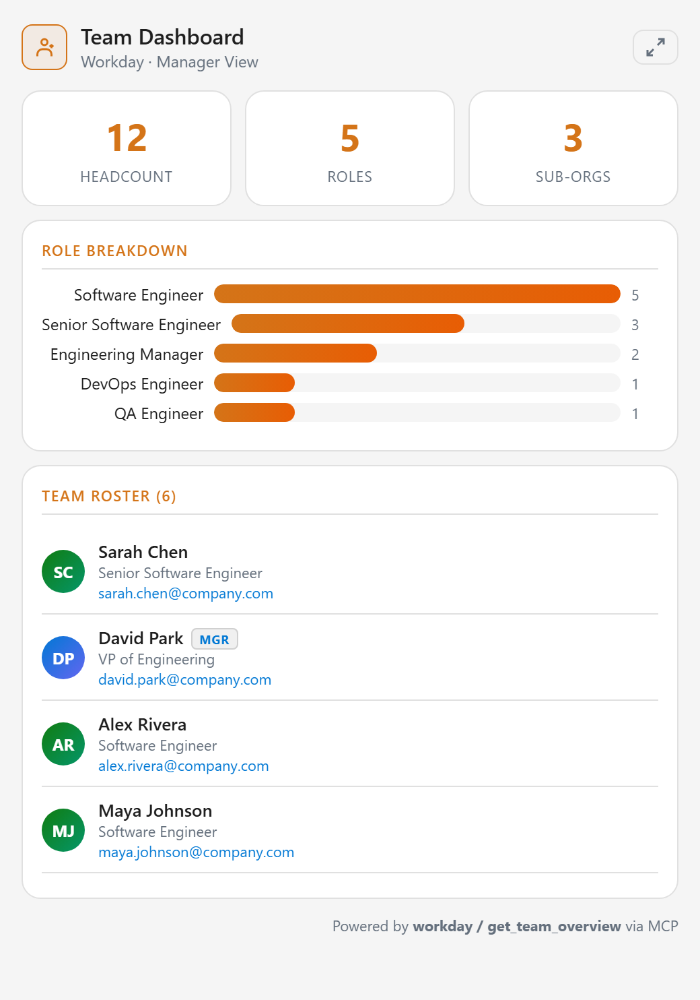
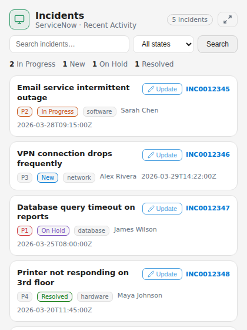
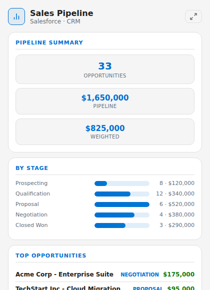
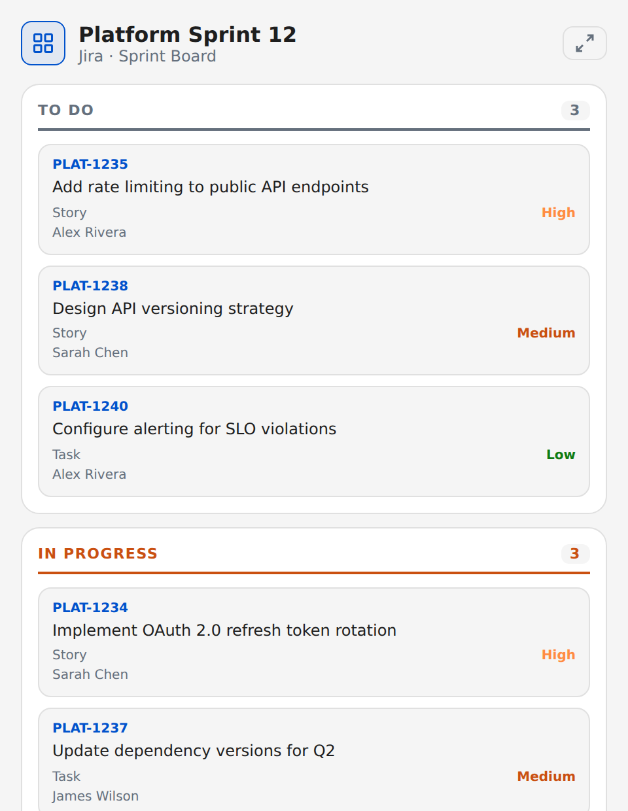
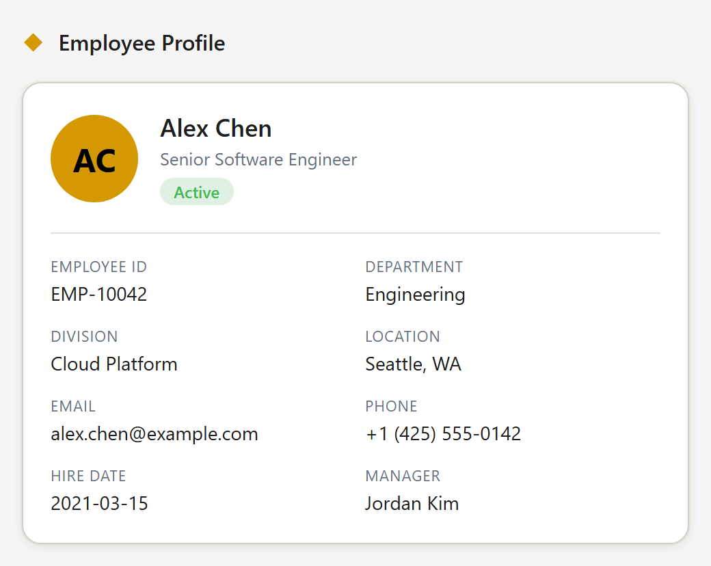
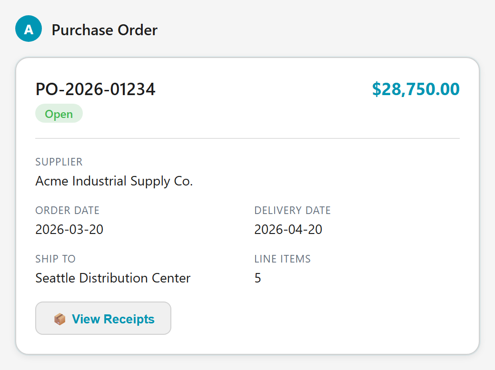

<p align="center">
  <h1 align="center">🏢 ESS-MCP</h1>
  <p align="center">
    <strong>Enterprise Self-Service, end-to-end on the Model Context Protocol</strong><br/>
    7 production-grade MCP servers · 1 Microsoft 365 Copilot declarative agent · 5 Copilot Cowork plugins · 1 autonomous Agent 365 teammate
  </p>
  <p align="center">
    <a href="docs/mcp-servers.md"></a>
    <a href="docs/widgets.md"></a>
    <a href="docs/mcp-servers.md#per-server-tool-reference"></a>
    <a href="docs/cowork-plugins.md"></a>
    <a href="docs/demo-agent.md"></a>
  </p>
</p>

---

## 📖 What is ESS-MCP?

**ESS-MCP** is a complete reference implementation of enterprise self-service powered by the [Model Context Protocol](https://modelcontextprotocol.io/) — and a worked example of every shape an AI agent can take inside the Microsoft cloud:

1. 🔧 **Core MCP servers** — modular, actionable Workday, ServiceNow, Salesforce, Jira, SAP SuccessFactors, SAP Ariba, and Coupa servers with **204 tools** and **76 interactive HTML+Skybridge widgets**.
2. 🟦 **Microsoft 365 Copilot Declarative Agent** — *Employee Self Service* declarative agent that wires all 7 MCP servers into Copilot as **RemoteMCP plugins**, alongside SharePoint, OneDrive, and Graph Connector knowledge.
3. 🟪 **Copilot Cowork plugins** — 5 packaged Cowork plugins, each pairing a fleet of **Agent Skills** (dashboards, decks, Adaptive Cards, executive briefs) with the matching ESS-MCP server as a **remote MCP connector**.
4. 🤖 **Autonomous Demo Agent** — a hosted, autonomous AI teammate with its **own Microsoft Entra Agent Identity**, fully integrated with **Agent 365** (Entra, Purview, Defender, M365 Admin Center → Agents, Foundry), running ESS-MCP tools through the **APIM AI Gateway** with end-to-end OpenTelemetry observability.

> *One repo, one consistent enterprise toolset, surfaced four different ways across Copilot, Cowork, and autonomous agents — all governed through Agent 365.*

---

## 🧭 The four pillars

<table>
<tr>
<td width="50%" valign="top">

### 🔧 [MCP Servers](docs/mcp-servers.md)

Modular, single-image MCP servers for **7 enterprise platforms** — each exposing actionable tools and widgets that an AI agent can render, edit, and submit.

- **204 tools** (read, create, update, action, callbacks)
- **76 interactive widgets** with dark/light mode, fullscreen, cross-widget navigation
- **5 manager dashboards** for cross-system team views
- stdio · SSE · Streamable HTTP · combined ASGI gateway
- One-command **Azure Container Apps** deploy via ACR remote build

→ [See all MCP servers](docs/mcp-servers.md) · [Widget gallery](docs/widgets.md) · [Deployment](docs/deployment.md)

</td>
<td width="50%" valign="top">

### 🟦 [M365 Copilot Declarative Agent](docs/declarative-agent.md)

*Employee Self Service* — a complete declarative agent package that wires every ESS-MCP server into Copilot as a **RemoteMCP** plugin and adds SharePoint, OneDrive, and Graph Connector knowledge.

- 7 `RemoteMCPServer` plugins under `declarative_agent/appPackage/`
- OAuth via Teams Developer Center **OAuthPluginVault** references
- `discourage_model_knowledge` so answers come from MCP tools
- Curated conversation starters and instructions
- Packaged via Microsoft 365 Agents Toolkit (`m365agents.yml`)

→ [Set up the declarative agent](docs/declarative-agent.md) · [Agent prompts](docs/prompts.md)

</td>
</tr>
<tr>
<td width="50%" valign="top">

### 🟪 [Copilot Cowork Plugins](docs/cowork-plugins.md)

5 Copilot Cowork plugins that pair **Agent Skills** (daily dashboards, PowerPoint review decks, Adaptive Card team updates) with their ESS-MCP server as a remote MCP connector.

- 🟦 **Workday People Leader** — 5 skills
- 🟧 **ServiceNow IT Operations** — 5 skills
- 🟩 **Salesforce Sales Intelligence** — 6 skills (+ WorkIQ)
- 🟦 **Jira Delivery Intelligence** — 5 skills
- 🟫 **Coupa Procurement Intelligence** — 1 skill

All packaged as Teams app `.zip`s, ready to upload via M365 Admin Center.

→ [See all Cowork plugins](docs/cowork-plugins.md)

</td>
<td width="50%" valign="top">

### 🤖 [Autonomous Demo Agent](docs/demo-agent.md)

A hosted autonomous AI teammate with its **own Entra Agent Identity**, fully integrated with **Agent 365** — calling MCP tools through the APIM AI Gateway with end-to-end Purview / Defender / OpenTelemetry observability.

- **Entra Agent Identity Blueprint** + per-instance Agent Identity
- **APIM AI Gateway** with `X-Agent-Identity-Id` headers
- `agent_client_assertion` & `token_exchange` token modes (no static tokens)
- HITL gates · tool deny-list · isolation actions in the **control plane**
- Foundry · Purview DSPM-for-AI · Defender XDR · M365 Admin Agents

→ [See the demo agent + control plane](docs/demo-agent.md)

</td>
</tr>
</table>

---

## 🖼️ See it in action

### The MCP widget surface — 76 widgets that AI agents render and act on

Every widget renders inline in Microsoft 365 Copilot, ChatGPT, Claude, or any MCP-aware client. Forms submit straight to MCP tool callbacks — the agent never has to compose JSON.

<table>
  <tr>
    <td align="center"><strong>Workday — Team Dashboard</strong></td>
    <td align="center"><strong>ServiceNow — Incident List</strong></td>
  </tr>
  <tr>
    <td></td>
    <td></td>
  </tr>
  <tr>
    <td align="center"><strong>Salesforce — Sales Pipeline</strong></td>
    <td align="center"><strong>Jira — Sprint Board</strong></td>
  </tr>
  <tr>
    <td></td>
    <td></td>
  </tr>
  <tr>
    <td align="center"><strong>SAP SuccessFactors — Employee Profile</strong></td>
    <td align="center"><strong>SAP Ariba — PO Status</strong></td>
  </tr>
  <tr>
    <td></td>
    <td></td>
  </tr>
</table>

→ **[Browse all 76 widgets in the widget gallery](docs/widgets.md)**

### The autonomous demo agent — Agent 365 control plane

A custom pane of glass for the demo agent: agent identities, hosted instances, tool catalogues, deny-list, run telemetry, and one-click deep links into Entra, Purview, Defender, and the M365 Admin Center Agents blade.

<table>
  <tr>
    <td align="center"><strong>Operations dashboard</strong></td>
    <td align="center"><strong>Connected identities & governance</strong></td>
  </tr>
  <tr>
    <td></td>
    <td></td>
  </tr>
  <tr>
    <td align="center"><strong>Live run telemetry</strong></td>
    <td align="center"><strong>Skill run output</strong></td>
  </tr>
  <tr>
    <td></td>
    <td></td>
  </tr>
</table>

→ **[See the demo agent page for full Agent 365 integration details](docs/demo-agent.md)**

---

## 🚀 Quick start

```bash
git clone https://github.com/scadam/ess-mcp.git
cd ess-mcp/mcp_servers
pip install -e ".[dev]"

# Run all servers locally
python -m mcp_servers.cli all --transport both --port 8080

# Health check
curl http://localhost:8080/healthz
```

Then choose your path:

| Goal | Start here |
|------|------------|
| Run the MCP servers locally or deploy to Azure | [docs/mcp-servers.md](docs/mcp-servers.md) · [docs/deployment.md](docs/deployment.md) |
| Wire all 7 MCP servers into Microsoft 365 Copilot | [docs/declarative-agent.md](docs/declarative-agent.md) |
| Build dashboards & decks in Copilot Cowork | [docs/cowork-plugins.md](docs/cowork-plugins.md) |
| Run an autonomous Agent 365 teammate on top of the MCP servers | [docs/demo-agent.md](docs/demo-agent.md) |
| Drop in production-quality system + skill prompts | [docs/prompts.md](docs/prompts.md) |

---

## 🏗️ End-to-end architecture

```
                  ┌────────────────────────────────────────────────────────────┐
                  │           Microsoft 365 + Foundry  ("Agent 365")           │
                  │  Entra Agent ID · Purview DSPM-for-AI · Defender XDR ·     │
                  │  M365 Admin Center → Agents · Azure AI Foundry             │
                  └─────────────┬──────────────────────────────┬───────────────┘
                                │                              │
            ┌───────────────────┴──────┐         ┌─────────────┴──────────────┐
            ▼                          ▼         ▼                            ▼
  ┌────────────────────┐   ┌────────────────────┐   ┌──────────────────────────┐
  │ M365 Copilot       │   │ Copilot Cowork     │   │ Autonomous Demo Agent    │
  │ Declarative Agent  │   │ Plugins + Skills   │   │ (Agent Identity, HITL)   │
  │ (RemoteMCP × 7)    │   │ (5 plugins)        │   │                          │
  └─────────┬──────────┘   └─────────┬──────────┘   └──────────────┬───────────┘
            │                        │                             │
            │ MCP (SSE / Streamable HTTP)        ┌─────────────────┴───────────┐
            ▼                        ▼           ▼     APIM AI Gateway          │
  ┌─────────────────────────────────────────────────────────────────────────────┴───┐
  │                         ESS-MCP Gateway  (port 8080)                            │
  │  /workday  /servicenow  /salesforce  /jira  /sap_sf  /ariba  /coupa  /healthz   │
  └──┬─────────────┬──────────────┬───────────┬─────────┬──────────┬───────────────┘
     ▼             ▼              ▼           ▼         ▼          ▼
  Workday    ServiceNow     Salesforce      Jira     SAP SF   Ariba  Coupa (mock)
```

Bearer-token passthrough by default; the Demo Agent additionally fronts the gateway with **APIM AI Gateway** for policy, identity-asserted token exchange, and full observability.

---

## 🧩 Project structure

```
ess-mcp/
├── README.md                       ← you are here
├── docs/                           ← documentation site
│   ├── mcp-servers.md              ← MCP server deep dive
│   ├── widgets.md                  ← Full 76-widget gallery
│   ├── deployment.md               ← Azure deploy + per-SaaS OAuth setup
│   ├── declarative-agent.md        ← M365 Copilot declarative agent
│   ├── cowork-plugins.md           ← 5 Copilot Cowork plugins
│   ├── demo-agent.md               ← Autonomous Agent 365 teammate
│   ├── prompts.md                  ← Agent system prompt + skill prompts
│   └── images/                     ← Widget screenshots
├── deploy.sh                       ← One-command Azure deploy
├── deploy/                         ← Bicep + deploy scripts
├── mcp_servers/                    ← 7 MCP servers
│   └── src/mcp_servers/
│       ├── cli.py, settings.py, logging.py
│       ├── auth/  http/  ui/widget/
│       ├── workday/ servicenow/ salesforce/ jira/
│       └── sap_sf/ ariba/ coupa/
├── declarative_agent/              ← M365 Copilot declarative agent
│   ├── appPackage/                 ← declarativeAgent.json + 7 *-mcp-plugin.json
│   └── m365agents.yml
├── cowork/plugins/                 ← 5 Copilot Cowork plugins (each .zip-packaged)
│   ├── workday-people-leader/
│   ├── servicenow-it-operations/
│   ├── salesforce-sales-intelligence/
│   ├── jira-delivery-intelligence/
│   └── coupa-procurement-intelligence/
├── demo_agent/                     ← Autonomous Agent 365 demo
│   ├── agent.py · web.py · identity.py · oauth.py
│   ├── governance.py · hitl.py · observability.py · purview.py
│   ├── gateway/apim-mcp-policy.xml ← APIM AI Gateway policy
│   ├── skills/                     ← 9 cross-system skills
│   ├── static/control-plane.html   ← Custom Agent 365 control plane
│   └── AGENT365_SETUP.md
└── widget-preview/                 ← Local widget gallery server
```

---

## 📄 License

This project is licensed under the [MIT License](LICENSE).
