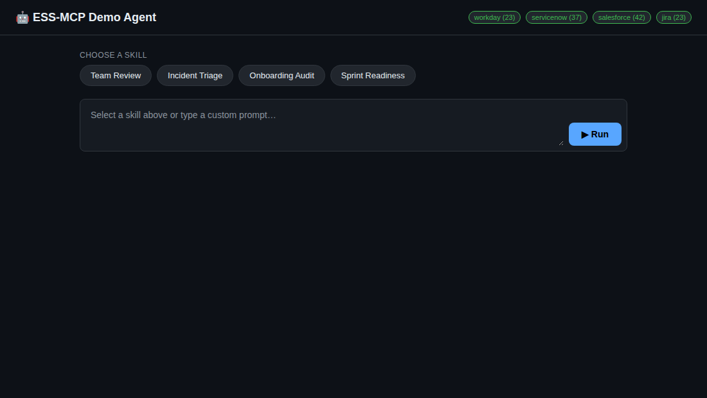
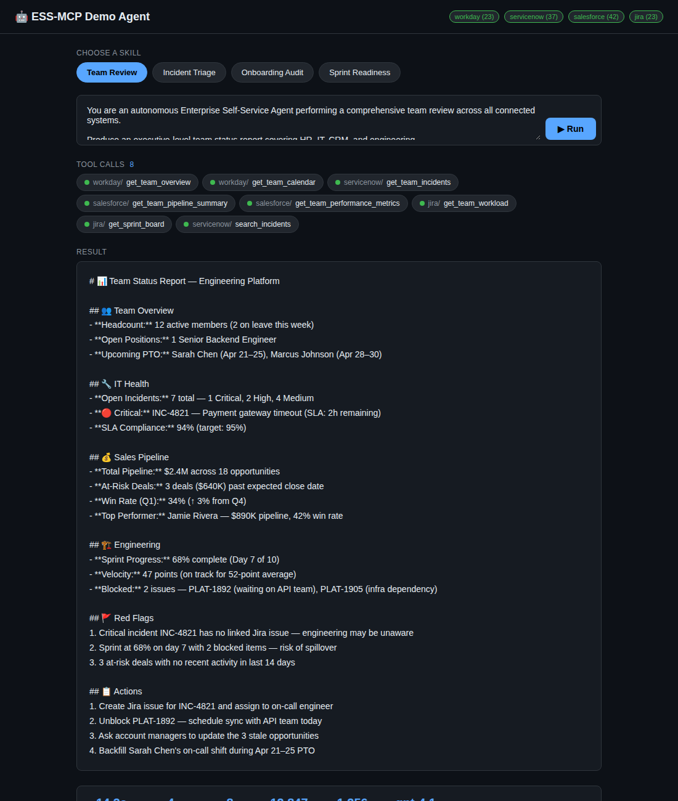

# 🤖 Demo Agent — GitHub Copilot SDK + MCP

A reference implementation showing how to build an **autonomous agentic loop**
using the **GitHub Copilot SDK** (GitHub Models API + OpenAI Python client) and
the **Model Context Protocol (MCP)**. Skills are plain-text markdown prompts
that tell the model what to do with the MCP tools.

---

## How the GitHub Agent Runs

The agent combines two pieces:

1. **GitHub Models** for LLM inference — the OpenAI Python SDK pointed at
   GitHub's inference endpoint (`https://models.inference.ai.azure.com`),
   authenticated with a GitHub Personal Access Token.
2. **MCP servers** for enterprise tool access — FastMCP connects to ESS-MCP
   servers that expose tools for Workday, ServiceNow, Salesforce, and Jira.

```
┌──────────────────────────────────────────────────────────┐
│                     Demo Agent                           │
│                                                          │
│  1. Load a skill prompt  (skills/*.md)                   │
│  2. Discover MCP tools   (FastMCP → list_tools)          │
│  3. Send prompt + tools to model (GitHub Models API)     │
│  4. Model returns tool_calls → execute via MCP           │
│  5. Feed results back → repeat until final answer        │
│                                                          │
│  ┌──────────────┐    ┌──────────────────────────┐        │
│  │ Skill Prompt │───▶│ GitHub Models API         │        │
│  │ (markdown)   │    │ (models.inference.ai.     │        │
│  └──────────────┘    │  azure.com)               │        │
│                      │                           │        │
│                      │ ◀── tool_calls ──▶        │        │
│                      └──────────┬───────────────┘        │
│                                 │                        │
│              ┌──────────────────┼──────────────────┐     │
│              ▼                  ▼                  ▼      │
│  ┌──────────────┐  ┌──────────────┐  ┌──────────────┐   │
│  │ Workday MCP  │  │ServiceNow MCP│  │Salesforce MCP│   │
│  └──────────────┘  └──────────────┘  └──────────────┘   │
└──────────────────────────────────────────────────────────┘
```

### Key code (agent.py)

```python
from openai import AsyncOpenAI

# Point the OpenAI client at GitHub Models
client = AsyncOpenAI(
    base_url="https://models.inference.ai.azure.com",
    api_key=os.environ["GITHUB_TOKEN"],
)

# The agentic loop
for turn in range(max_turns):
    resp = await client.chat.completions.create(
        model="gpt-4.1", messages=messages, tools=mcp_tools,
    )
    if not resp.choices[0].message.tool_calls:
        break  # final answer
    # execute each tool call via MCP, append results, repeat
```

No separate OpenAI API key is needed — the `GITHUB_TOKEN` handles both
authentication and billing.

---

## How It Is Paid For

The agent accesses models through **GitHub Models**, which is included in
GitHub Copilot subscriptions. Model usage counts against your plan's
allowance.

| Plan | Monthly Cost | Model Access | Rate Limits |
|------|-------------|--------------|-------------|
| **GitHub Free** | $0 | Limited GitHub Models access | Low request/token limits |
| **Copilot Free** | $0 | GPT-4o, Claude 3.5 Sonnet (limited) | 2,000 completions/month |
| **Copilot Pro** | $10/month | GPT-4.1, GPT-4o, Claude, Gemini, o3/o4-mini | Higher limits |
| **Copilot Pro+** | $39/month | All models + agent mode | Highest limits, priority |
| **Copilot Business** | $19/user/month | All models, org management | Per-org policies |
| **Copilot Enterprise** | $39/user/month | All models + knowledge bases | Enterprise features |

> **For this demo agent:** A **Copilot Pro** ($10/month) or **Copilot Free**
> plan is sufficient. The agent runs against the GitHub Models endpoint, and
> each chat-completion call consumes tokens from your plan's allowance. If you
> exceed your plan's included usage, GitHub will prompt you to upgrade or wait
> for the next billing cycle.

### What you need

1. A **GitHub account** (free or paid)
2. A **GitHub Personal Access Token** — create one at
   [github.com/settings/tokens](https://github.com/settings/tokens)
   (classic or fine-grained; no special scopes required for GitHub Models)
3. Set `GITHUB_TOKEN` in your `.env` file

That's it — no OpenAI account, no Azure subscription, no credit card
(beyond your GitHub plan) is needed for the LLM inference.

---

## Quick Start

```bash
pip install fastmcp openai python-dotenv aiohttp   # already in mcp_servers deps
cp .env.example .env                                # add your GITHUB_TOKEN + MCP tokens
```

### Web UI (recommended for demos)

```bash
python -m demo_agent.web          # open http://localhost:8091
```

The web UI lets you:
- Pick a **skill** from clickable pills (or type a custom prompt)
- Watch **tool calls** appear as pills in real time
- Click any tool pill to inspect its **input** and **output**
- See the **final result** rendered below
- Review **statistics** — duration, turns, tool calls, token usage, model

#### Choose a skill and connect to MCP servers



#### Completed run with tool calls, result, and statistics



### CLI

```bash
python -m demo_agent.agent team-review     # run a skill from the command line
```

### Hiring Control Plane

```bash
python -m demo_agent.web          # open http://localhost:8091/hiring
```

The hiring control plane is a dedicated UI at `/hiring` that demonstrates
an **agentic hiring workflow** with human-in-the-loop orchestration:

- **Dashboard overview** — KPIs (active hires, autonomous runs, exceptions, SLA health), exception cards with severity indicators, fleet economics, and policy thresholds
- **Workflow drill-down** — click any hire to see the full pipeline (Request Filed → Job Design → Sourcing → Budget Approval → Screening → Interview → Offer) with stage-by-stage status
- **Human escalation points** — intervention modals for budget re-routing, compliance overrides, ethics reviews, document requests, and more. Each intervention includes pre-filled context, justification fields, and audit trails
- **Agent activity log** — real-time view of MCP tool calls made by each agent in the fleet (Sourcing Agent, Budget Agent, Compliance Agent, etc.)
- **Fleet assignment** — which agents are active, blocked, or on standby for each hire
- **Bulk approval queue** — batch approve routine items (interview schedules, offer letters)

The control plane uses **synthetic data** in `data/hiring-scenarios.json` with
5 active hires (3 with exceptions requiring human attention) to demonstrate
the concept without requiring live MCP server connections.

---

## Available Skills

| Skill | File | Servers Used |
|-------|------|--------------|
| `team-review` | `skills/team-review.md` | Workday + ServiceNow + Salesforce + Jira |
| `incident-triage` | `skills/incident-triage.md` | ServiceNow + Jira |
| `onboarding-audit` | `skills/onboarding-audit.md` | Workday + ServiceNow + Salesforce + Jira |
| `sprint-readiness` | `skills/sprint-readiness.md` | Jira + Workday + ServiceNow |
| `hiring-pipeline` | `skills/hiring-pipeline.md` | Workday + ServiceNow + Salesforce + Jira |

---

## Auth: Per-Server Bearer Tokens (MCP)

Each MCP server hits a different SaaS API (Workday REST, ServiceNow REST, etc.)
so each one needs its own OAuth Bearer token. The token is injected as an HTTP
header when connecting:

```python
StreamableHttpTransport(url, headers={"Authorization": f"Bearer {token}"})
```

### How to get MCP tokens

| Strategy | When to use | Setup |
|----------|-------------|-------|
| **Static tokens** | Dev / short demos | Acquire via `az account get-access-token`, Postman, or platform CLI. Set `ESS_<SERVER>_TOKEN`. |
| **Client credentials** | Production daemons | Register an OAuth app per platform, acquire tokens at startup. Swap the `os.getenv` call for a token-provider function. |
| **On-behalf-of (OBO)** | Delegated user context | Front-end acquires user token via auth-code flow, agent exchanges via Azure AD OBO. Same swap — just change how you get the token string. |

The agent doesn't care *how* the MCP token was obtained — it just needs a
string in the `Authorization` header. For production, replace the
`os.getenv()` lines in `connect()` with your preferred token provider.

---

## Writing New Skills

Create `skills/my-skill.md` with a system-prompt-style markdown file. The agent
reads it, sends it to the model (via GitHub Models) with all discovered MCP
tools, and lets the model execute autonomously until it produces a final text
answer.

```bash
python -m demo_agent.agent my-skill
```

---

## Environment Variables

| Variable | Required | Description |
|----------|----------|-------------|
| `GITHUB_TOKEN` | **Yes** | GitHub Personal Access Token for GitHub Models API |
| `ESS_MODEL` | No | Model to use (default: `gpt-4.1`) |
| `ESS_MAX_TURNS` | No | Maximum agentic loop turns (default: `25`) |
| `ESS_WORKDAY_MCP_URL` | No | Workday MCP server URL |
| `ESS_WORKDAY_TOKEN` | No | Workday Bearer token |
| `ESS_SERVICENOW_MCP_URL` | No | ServiceNow MCP server URL |
| `ESS_SERVICENOW_TOKEN` | No | ServiceNow Bearer token |
| `ESS_SALESFORCE_MCP_URL` | No | Salesforce MCP server URL |
| `ESS_SALESFORCE_TOKEN` | No | Salesforce Bearer token |
| `ESS_JIRA_MCP_URL` | No | Jira MCP server URL |
| `ESS_JIRA_TOKEN` | No | Jira Bearer token |
