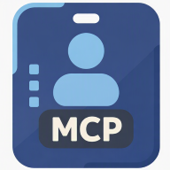

# 🟦 Declarative Agent — Microsoft 365 Copilot + RemoteMCP

[← Back to main README](../README.md) · See also: [MCP Servers](mcp-servers.md) · [Deployment & OAuth](deployment.md) · [Agent Prompts](prompts.md)

ESS-MCP ships a complete **Microsoft 365 Copilot declarative agent** — *Employee Self Service* — that wires every ESS-MCP server into Copilot as a **RemoteMCP** plugin alongside SharePoint, OneDrive, and Graph Connector knowledge sources.

The agent lives in [`declarative_agent/`](../declarative_agent) and is packaged via Microsoft 365 Agents Toolkit (m365agents.yml).

<p align="center">
  
</p>

## What's in the box

| File | Purpose |
|------|---------|
| `appPackage/manifest.json` | Teams / M365 app manifest |
| `appPackage/declarativeAgent.json` | Declarative agent definition (instructions, conversation starters, capabilities, plugin list) |
| `appPackage/workday-mcp-plugin.json` | RemoteMCP plugin → Workday MCP server |
| `appPackage/servicenow-mcp-plugin.json` | RemoteMCP plugin → ServiceNow MCP server |
| `appPackage/salesforce-mcp-plugin.json` | RemoteMCP plugin → Salesforce MCP server |
| `appPackage/jira-mcp-plugin.json` | RemoteMCP plugin → Jira MCP server |
| `appPackage/sap-sf-mcp-plugin.json` | RemoteMCP plugin → SAP SuccessFactors MCP server |
| `appPackage/ariba-mcp-plugin.json` | RemoteMCP plugin → SAP Ariba MCP server |
| `appPackage/coupa-mcp-plugin.json` | RemoteMCP plugin → Coupa MCP server (mocked) |
| `m365agents.yml` / `m365agents.local.yml` | Agents Toolkit project file |

The agent advertises:

- **All 7 ESS-MCP RemoteMCP plugins** (204 tools, 76 widgets)
- **OneDrive & SharePoint** capability for grounded answers
- **Graph Connectors** for ingested ServiceNow KB articles
- Curated **conversation starters** ("Show My Org Chart", "Open Team Dashboard", …)
- A `discourage_model_knowledge` behavior override so answers come from MCP tools, not the model's general knowledge

## Registering OAuth in Teams Developer Center

Each RemoteMCP plugin uses an **OAuthPluginVault** reference. Before the agent will work in Copilot, register one OAuth client per SaaS platform (see **[deployment.md → OAuth Client Setup](deployment.md#oauth-client-setup-per-saas-platform)**), then register them in the Teams Developer Center:

1. Open [dev.teams.microsoft.com](https://dev.teams.microsoft.com/) and sign in as an M365 admin/developer.
2. **Apps** → open your declarative agent app (or create a new one).
3. **Tools → OAuth client registrations → New OAuth client registration** and fill in:

   | Field | Value |
   |-------|-------|
   | Registration name | e.g. `workday-oauth`, `salesforce-oauth` |
   | Client ID | OAuth Client ID from your SaaS platform |
   | Client Secret | OAuth Client Secret from your SaaS platform |
   | Authorization endpoint | SaaS platform's authorization URL |
   | Token endpoint | SaaS platform's token URL |
   | Scope | Space-separated list of scopes required by the SaaS platform |

   Example for Salesforce:

   | Field | Value |
   |-------|-------|
   | Registration name | `salesforce-oauth` |
   | Authorization endpoint | `https://login.salesforce.com/services/oauth2/authorize` |
   | Token endpoint | `https://login.salesforce.com/services/oauth2/token` |
   | Scope | `full refresh_token` |

4. **Copy the Registration ID** — you'll reference it from each RemoteMCP plugin file (`reference_id`).
5. Repeat for each SaaS platform you want to connect (one registration per OAuth provider).

## RemoteMCP plugin file shape

Each `*-mcp-plugin.json` file follows the `RemoteMCPServer` plugin schema:

```json
{
  "$schema": "https://aka.ms/json-schemas/copilot/plugin/v2.4/schema.json",
  "schema_version": "v2.4",
  "name_for_human": "Enterprise Self-Service",
  "description_for_human": "HR, IT, CRM, and project management tools powered by MCP",
  "description_for_model": "Connects to Workday, ServiceNow, Salesforce, Jira, SAP SuccessFactors, Ariba, and Coupa via MCP servers.",
  "contact_email": "admin@yourorg.com",
  "namespace": "ess_mcp",
  "runtimes": [
    {
      "type": "RemoteMCPServer",
      "auth": {
        "type": "OAuthPluginVault",
        "reference_id": "{workday-oauth-registration-id}"
      },
      "spec": {
        "url": "https://essmcp-workday.azurecontainerapps.io/workday/mcp",
        "mcp_tool_description": { "file": "workday-mcp-tools.json" }
      }
    }
  ]
}
```

> Replace `{…-oauth-registration-id}` with the Registration IDs from Teams Developer Center, and the `url` values with your deployed MCP server endpoints (see [deployment.md](deployment.md)).

## End-to-end setup checklist

1. ✅ Deploy ESS-MCP servers to Azure Container Apps → [deployment.md](deployment.md)
2. ✅ Create OAuth clients in each SaaS platform → [deployment.md → OAuth Client Setup](deployment.md#oauth-client-setup-per-saas-platform)
3. ✅ Register OAuth connections in [Teams Developer Center](https://dev.teams.microsoft.com/)
4. ✅ Update the URLs and `reference_id` values in each `*-mcp-plugin.json` under `declarative_agent/appPackage/`
5. ✅ Provision & publish with Microsoft 365 Agents Toolkit (`m365agents.yml`)
6. ✅ Test in Microsoft 365 Copilot — Copilot will prompt the user for OAuth consent on first use of each plugin

## Recommended agent system prompt

A production-quality system prompt covering identity, tone, capabilities, interaction rules, and output formatting is shipped in **[prompts.md → Agent system prompt](prompts.md#agent-system-prompt)** along with five reusable Skill prompts (Employee Self-Service, IT Service Management, CRM & Sales, Project Management, Manager Dashboard).

---

[← Back to main README](../README.md)
