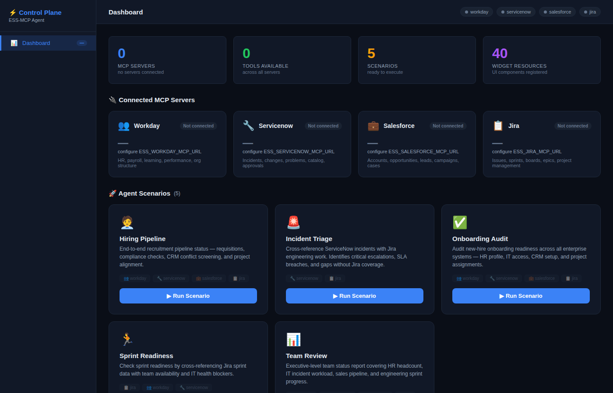
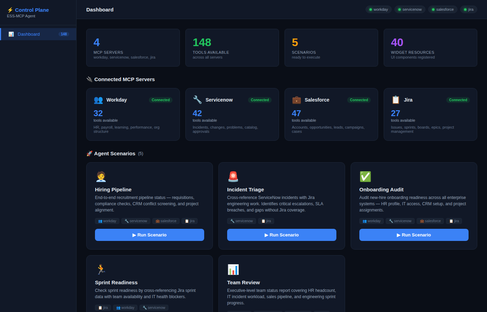
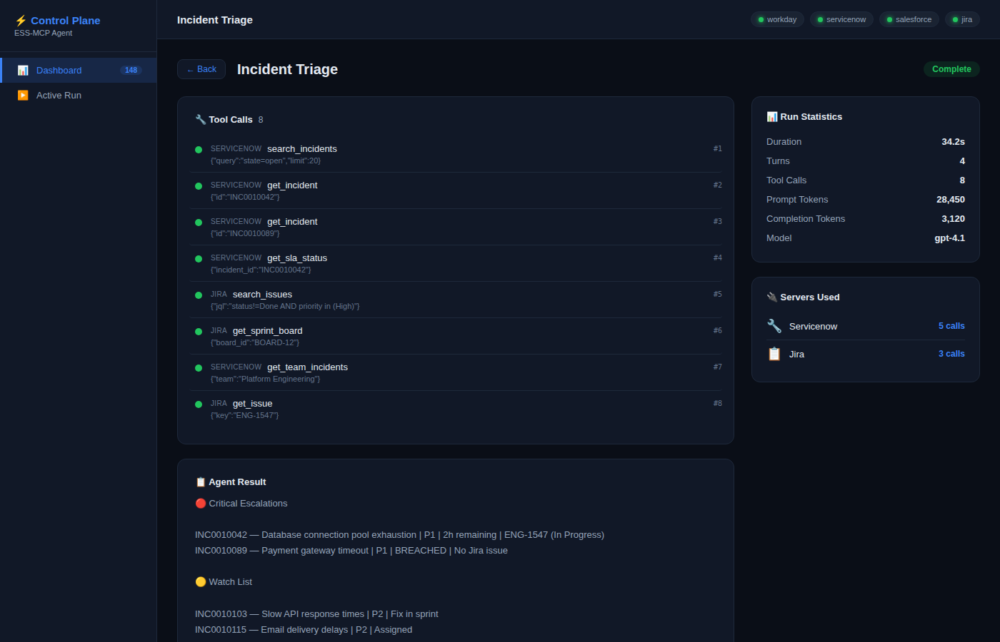
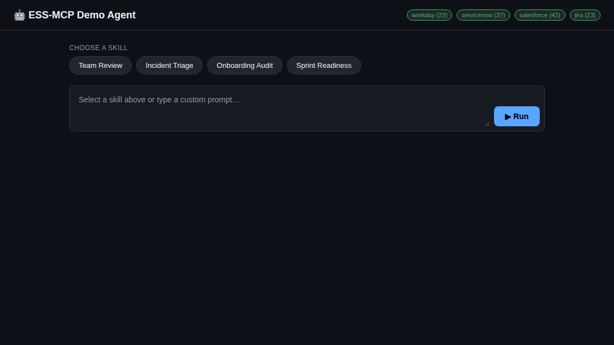
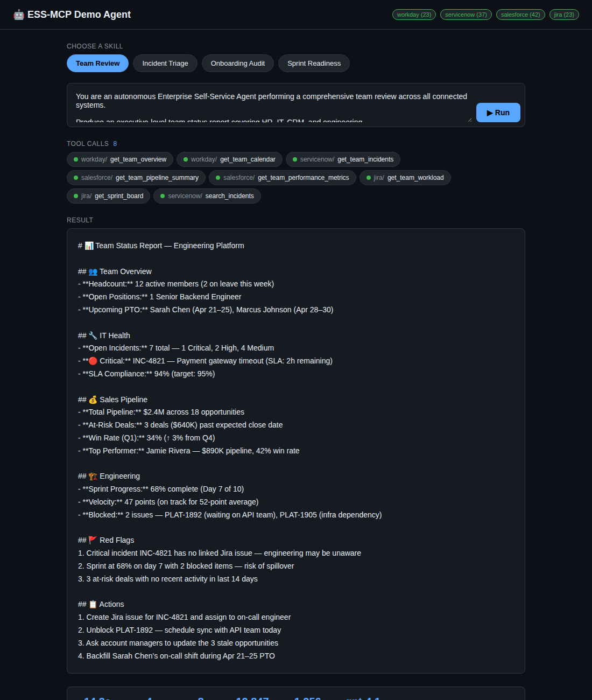

# 🤖 Demo Agent — Autonomous AI Teammate on Agent 365

[← Back to main README](../README.md) · See also: [MCP Servers](mcp-servers.md) · [Declarative Agent](declarative-agent.md)

The **Demo Agent** is an autonomous AI teammate that uses ESS-MCP servers to complete real Workday and ServiceNow work — with its **own Entra Agent Identity**, governed through the **Microsoft 365 + Foundry "Agent 365"** surfaces (Entra, Purview, Defender, M365 Admin Agents blade) and the **Azure API Management AI Gateway** for policy-enforced MCP access.

Where the [declarative agent](declarative-agent.md) is a Copilot-hosted assistant, the demo agent is a **hosted autonomous agent**: it picks a skill, plans, calls MCP tools, and produces an artifact, while every model call and tool call is captured by Purview, Defender, and OpenTelemetry traces.

The demo agent lives in [`demo_agent/`](../demo_agent). Full setup notes are in [`demo_agent/AGENT365_SETUP.md`](../demo_agent/AGENT365_SETUP.md).

---

## What makes it different

| Capability | How |
|------------|-----|
| **Real Agent Identity** | Microsoft Entra **Agent Identity Blueprint** + per-instance **Agent Identity** service principal (`ENTRA_AGENT_BLUEPRINT_CLIENT_ID`, `ENTRA_AGENT_IDENTITY_OBJECT_ID`) |
| **Governed MCP access** | Workday & ServiceNow MCP servers fronted by **Azure APIM AI Gateway** with `X-Agent-Identity-Id` and `X-Agent-Blueprint-Client-Id` headers (see [`demo_agent/gateway/apim-mcp-policy.xml`](../demo_agent/gateway/apim-mcp-policy.xml)) |
| **Token modes** | `agent_client_assertion` (Agent Identity JWT used as OAuth client assertion) and `token_exchange` (Agent Identity subject token exchanged with Workday/ServiceNow OAuth). No static tokens in production. |
| **OAuth bootstrap** | One-shot `oauth-bootstrap.py` flow that stores refresh tokens in Container Apps secrets / Key Vault — never in files |
| **Full observability** | OpenTelemetry spans + `agent.tool_call.observed` events with server, tool, call ID, full arguments + response, duration, payload sizes, payload hashes, Agent Identity, Blueprint, and Foundry agent metadata |
| **Purview & Defender** | DSPM-for-AI hub picks up prompts/responses; Defender XDR `Agents` blade shows posture; M365 Admin Center → Agents lists lifecycle |
| **Foundry correlation** | `AZURE_FOUNDRY_PROJECT_ENDPOINT` + `AZURE_FOUNDRY_AGENT_ID` correlate runs across registry, map, Purview, Defender |
| **Human-in-the-loop** | Built-in HITL approval gates (`hitl.py`) for sensitive actions surfaced in the control plane |

## Runtime flow

```text
Skill prompt
  → GitHub Models or Azure OpenAI
  → tool call:  workday__*  or  servicenow__*
  → OAuth token provider (agent client assertion / token exchange)
  → AI Gateway MCP endpoint (APIM)
  → ESS-MCP Workday / ServiceNow server
  → SaaS API
```

## Skills

The demo agent ships nine cross-system skills under [`demo_agent/skills/`](../demo_agent/skills):

| Skill | Focus |
|-------|-------|
| `team-review` | Workday people signals + ServiceNow health and approvals |
| `incident-triage` | ServiceNow incident / SLA triage with Workday availability context |
| `onboarding-audit` | Workday onboarding + ServiceNow provisioning readiness |
| `sprint-readiness` | Workday capacity + ServiceNow operational blockers |
| `hiring-pipeline` | Workday hiring context + ServiceNow provisioning |
| `cross-system-overview` | Employee self-service view across Workday + ServiceNow |
| `manager-approval` | Manager approval triage across systems |
| `procurement-to-invoice` | End-to-end procurement workflow |
| `requisition-approval-triage` | Requisition / approval queue triage |

## Control plane

The demo agent exposes a **custom control plane** at `/control-plane` — the pane of glass purpose-built for this demo. It exists to **prove the runtime emits first-class signals** that flow into Entra, Purview, Defender, and the M365 Admin Center.

### Operations dashboard

The control plane shows live agent identities, hosted instances, MCP tool catalogues, the tool deny-list, isolation actions, run history, and a deep-link rail into all four Microsoft 365 governance surfaces.

<p align="center">
  
</p>

### Connected agent identities & governance surfaces

Live connection state to Entra Agent Identity, Foundry agent, and the M365 governance surfaces card (Entra, Purview, Defender, M365 Admin Agents).

<p align="center">
  
</p>

### Watching a run

Real-time tool call telemetry — every MCP `tools/call` with arguments, response, duration, and the Agent Identity / Blueprint / Foundry IDs attached to each span.

<p align="center">
  
</p>

### Simple run UI

A lightweight launcher to pick a skill, set the target user, and kick off a run from the same hosted instance.

<p align="center">
  
</p>

### Final artifact

Outputs are surfaced inline (HTML dashboards, decks, markdown briefs) with the full chain of tool calls retained for audit.

<p align="center">
  
</p>

---

## Run it

```powershell
# Web UI (simple run + control plane)
python -m demo_agent.web
# → http://localhost:8091/
# → http://localhost:8091/control-plane

# CLI — pick any skill
python -m demo_agent.agent team-review
```

For the hosted Container Apps deployment, see the **deploy** scripts and [`AGENT365_SETUP.md`](../demo_agent/AGENT365_SETUP.md).

## Verifying Agent 365 integration

Before using this as a hosted demo, confirm:

- **Entra admin center** shows the Blueprint and Agent Identity
- **Microsoft 365 Admin Center → Agents** shows the agent in the registry
- **Foundry** shows the agent and its connected governed MCP tools
- **AI Gateway** logs include `X-Agent-Identity-Id` and `X-Agent-Blueprint-Client-Id`
- **Defender / Purview** traces include model calls and Workday/ServiceNow tool calls
- Each tool call has an `agent.tool_call.observed` span/event with server, tool, call ID, full arguments + response, duration, success/error, payload sizes, payload hashes, Agent Identity, Blueprint, and Foundry agent metadata

---

[← Back to main README](../README.md)
